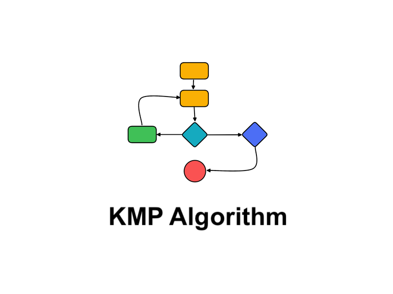

# KMP_Algorithm_Visualizer
Knuth Morris Pratt Pattern Matching Algorithm Visualizer s similar to the naive substring searching approach: at each step, it compares a pattern with a substring of a text trying to find a complete match. The difference between these two algorithms is how they process the case of mismatched symbols. 

