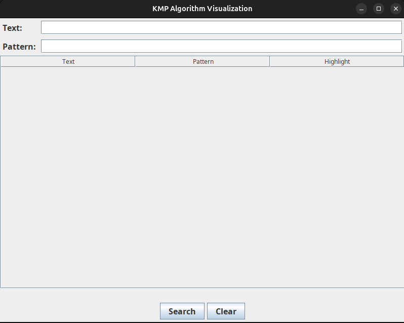
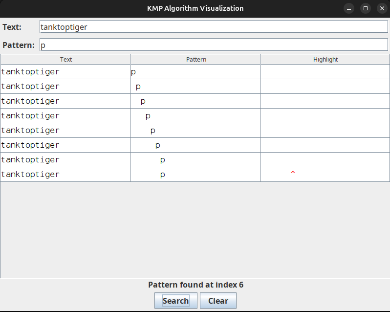
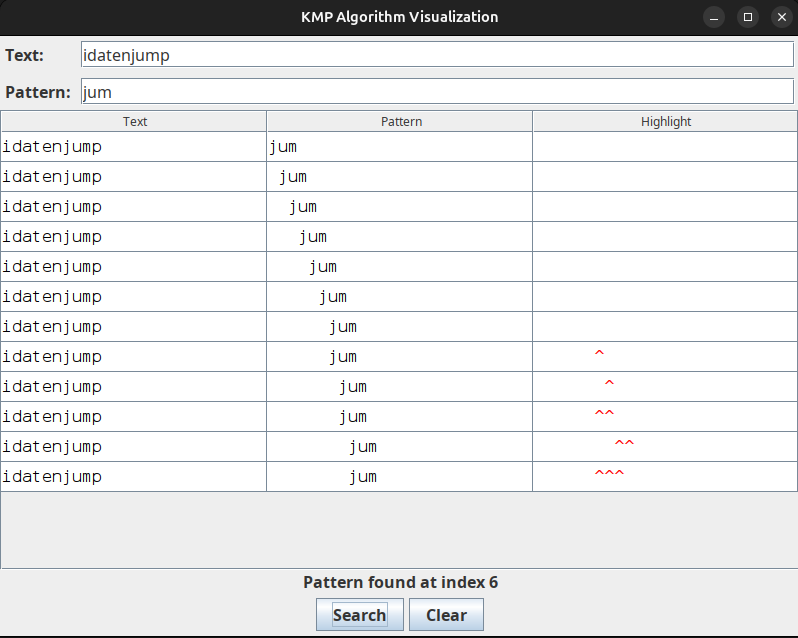

# KMP_Algorithm_Visualizer
Knuth Morris Pratt Pattern Matching Algorithm Visualizer s similar to the naive substring searching approach: at each step, it compares a pattern with a substring of a text trying to find a complete match. The difference between these two algorithms is how they process the case of mismatched symbols. 

Sample Visualizing Screen output

## The Below Snapshots Represent the *Single Word Pattern* and **_Multiword Pattern_** Search Using **KMP Algorithm**

- *Single Word Pattern*: 
  - **Snapshot 1**: 
  
- **_Multiword Pattern_**:
  - **Snapshot 2**: 
  
- _For more details, refer to the following:_
  - **KMP Algorithm Documentation**
  - **Search Patterns**: **`<pattern>`**  _(highlighted text)_ and _**`<pattern>`**_
  
__**Note**__: _The snapshots represent the functionality of the KMP algorithm._

Implementation has a few drawbacks and areas that could be improved....
1. Inefficient Visualization:
The visualization updates the table with every single character comparison, which can lead to a large number of rows for long texts or patterns, making it difficult to follow the matching process.
Improvement: Implement a more summarized view, where the visualization focuses on significant steps, such as when the pattern moves or a match is found, rather than every single comparison.

2. Basic LPS Computation Visualization:
The program does not visualize the computation of the LPS array, which is a crucial part of understanding how the KMP algorithm works.
Improvement: Extend the visualization to include how the LPS array is constructed, helping users understand the preprocessing step of the KMP algorithm.

NOTE: Its very crucial in visualizing the KMP algorithm in REAL TIME, I have provided a simple simulation that how the KMP works, So every one can understand quickly..
Thanks!

This was Miniproject of my 4th Semester.
-- If anf Future Inprovements please help let me know -- 
contact: sunilr31r@gmail.com DM ME..

## How to Run the Program in Command Line (Windows/Linux)

**_Prerequisites:_** *JAVA JRE and JDK (any version)*

1. **_Compile the Java program_**

   **`javac KMPVisualizer.java`**

2. **_After compiling the program, run it!_**

   **`java KMPVisualizer`**

_The steps above should work in both Windows and Linux environments._

---

### Hashtags

#Algorithms #Java #Visualizer #Simulation #Project #JavaSwings #JavaApplet
